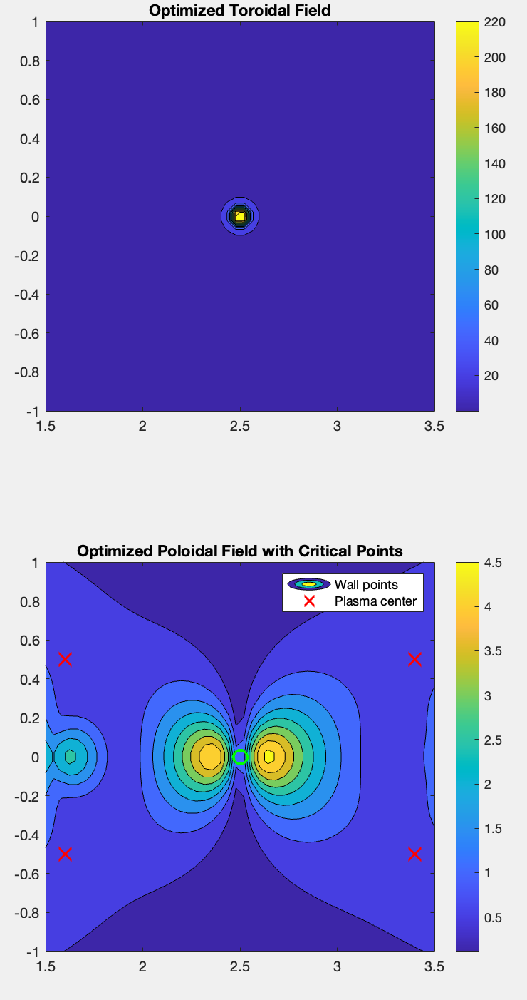

# Tokamak Coil Current Optimization



MATLAB code for optimizing tokamak coil currents using genetic algorithms to achieve target magnetic field configurations.

## Features
- **Coil Geometry Generation** - Automatic positioning of toroidal/poloidal coils
- **Field Calculation** - Biot-Savart law implementation
- **Multi-Objective Optimization** - Simultaneous toroidal/poloidal field control
- **Constraint Handling** - Wall shielding & plasma center requirements

## Installation
```bash
git clone https://github.com/yourusername/tokamak-optimization.git
cd tokamak-optimization
```

## Usage
```matlab
% Run optimization with default parameters
[I_opt, best_I, best_cost] = tokamak_optimization();

% Access results:
% I_opt(1:n_coils) - Toroidal currents
% I_opt(n_coils+1:end) - Poloidal currents
```

## Key Parameters
| Parameter       | Description                  | Default Value |
|-----------------|------------------------------|---------------|
| `R0`            | Major radius                 | 2.5 m         |
| `a`             | Minor radius                 | 1.0 m         |
| `n_coils`       | Number of toroidal coils     | 12            |
| `n_poloidal`    | Poloidal coils per side      | 6             |

## Optimization Targets
- **Toroidal Field**: 5.0 T ± 10% (uniform)
- **Poloidal Field**: 0.5 T ± 15% (shaped)
- **Critical Points**:
  ```text
  Wall Points: B_pol < 1.0 T
  Plasma Center: B_pol = 0.2 T ± 0.05
  ```

## Sample Output
```plaintext
Optimization complete. Best I value:
Toroidal currents: [1.02e+06 9.87e+05 ... ] A
Poloidal currents: [5.12e+05 4.95e+05 ... ] A
Final cost: 42.37

Field values at critical points:
Outer wall upper: 0.98 T
Outer wall lower: 0.97 T
Inner wall upper: 0.95 T
Inner wall lower: 0.96 T
Plasma center:    0.21 T
```

## Customization
```matlab
% Modify in tokamak_optimization.m
R0 = 3.0;  % Change major radius
a = 1.2;   % Modify minor radius

% Adjust GA parameters
options = optimoptions('ga',...
    'PopulationSize', 150,...
    'MaxGenerations', 300,...
    'FunctionTolerance', 1e-5);
```

## License
[MIT License](https://opensource.org/licenses/MIT) © 2024 Your Name
